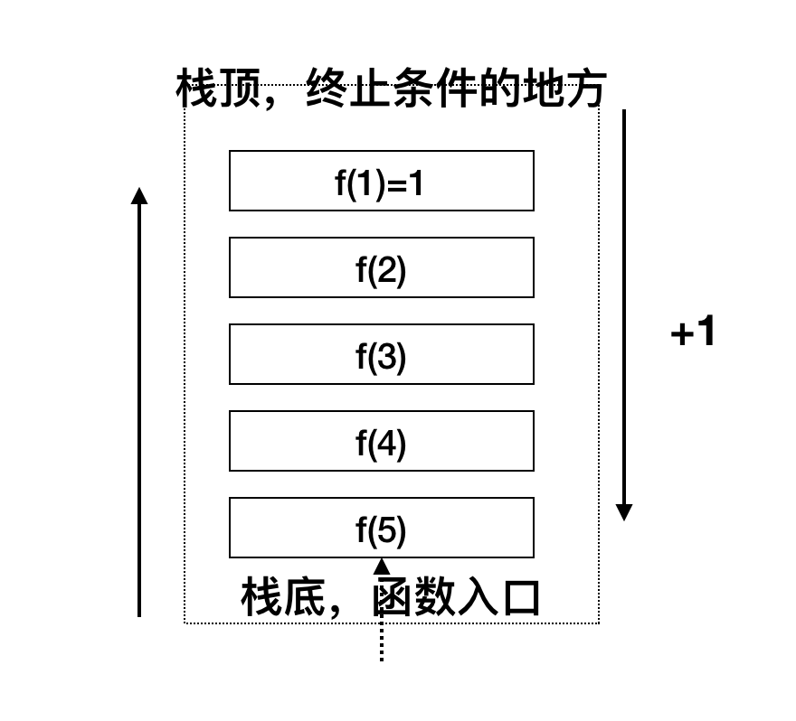

# leetcode顺序
| &emsp;题号&emsp; | 题目链接&emsp;&emsp;&emsp;&emsp;&emsp;&emsp;&emsp;&emsp;&emsp;&emsp;&emsp;&emsp;| 答案链接&emsp;&emsp;&emsp;&emsp;&emsp;&emsp;&emsp;&emsp;&emsp;&emsp;&emsp;&emsp;| &emsp;难度&emsp; | &emsp;完成度&emsp;  |
| :--: | :--: | :----------------------------------------------------------- | :-----------------------------------------------------------  | :------: |
|  1| [两数之和](https://leetcode-cn.com/problems/two-sum/) | [twoSum](./array/leetcode/easy/twoSum.h) | easy | ✅ |
|  2| [两数相加](https://leetcode-cn.com/problems/add-two-numbers/) | [addTwoNumbers](./linkedList/leetcode/medium/addTwoNumbers.h) |  medium  | ✅ |
|  3| [无重复字符的最长子串](https://leetcode-cn.com/problems/longest-substring-without-repeating-characters/) | [lengthOfLongestSubstring](./string/leetcode/medium/lengthOfLongestSubstring.h) |  medium  | ✅ |
|  5| [最长回文子串](https://leetcode-cn.com/problems/longest-palindromic-substring/) | [longestPalindrome](./string/leetcode/medium/longestPalindrome.h) |  medium [需要回看其他解法] | ✅ |
|  6| [Z字形变换](https://leetcode-cn.com/problems/zigzag-conversion/) | [zigzag_conversion](./string/leetcode/medium/zigzag_conversion.h) |  medium | ✅ |
|  7| [整数反转](https://leetcode-cn.com/problems/reverse-integer/) | [reverse_integer](./other/leetcode/easy/reverse_integer.h) | easy | ✅ |
|  8| [字符串转换整数 (atoi)](https://leetcode-cn.com/problems/string-to-integer-atoi/) | [string_to_integer_atoi](./string/leetcode/medium/string_to_integer_atoi.h) |  medium  | ✅ |
|  9| [回文数](https://leetcode-cn.com/problems/palindrome-number/) | [palindrome_number](./other/leetcode/easy/palindrome_number.h) | easy | ✅ |
|  11  | [盛最多水的容器](https://leetcode-cn.com/problems/container-with-most-water/) | [maxArea](./array/leetcode/maxArea.h) |  medium  | ✅ |
|  12  | [整数转罗马数字](https://leetcode-cn.com/problems/integer-to-roman/) | [integer_to_roman](./string/leetcode/medium/integer_to_roman.h) |  medium  | ✅ |
|  13| [罗马数字转整数](https://leetcode-cn.com/problems/roman-to-integer/) | [romanToInt](./string/leetcode/easy/romanToInt.h) | easy | ✅ |
|  14| [最长功能前缀](https://leetcode-cn.com/problems/longest-common-prefix/) | [longestCommonPrefix](./string/leetcode/easy/longestCommonPrefix.h) | easy | ✅ |
|  15  | [三数之和](https://leetcode-cn.com/problems/3sum/) | [3sum](./array/leetcode/medium/3sum.h) |  medium  | ✅ |
|  16  | [最接近的三数之和](https://leetcode-cn.com/problems/3sum-closest) | [3SumClosest](./array/leetcode/medium/3SumClosest.h) |  medium  | ✅ |
|  17  | [电话号码的字母组合](https://leetcode-cn.com/problems/letter-combinations-of-a-phone-number/) | [letter_combinations_of_a_phone_number](./backtracking/leetcode/medium/letter_combinations_of_a_phone_number.h) |  medium  | ✅ |
|  19  | [		删除链表的倒数第N个节点](https://leetcode-cn.com/problems/remove-nth-node-from-end-of-list)| [removeNthFromEnd](./linkedList/leetcode/removeNthFromEnd.h) |  medium | ✅ |
|  20   | [有限的括号](https://leetcode-cn.com/problems/valid-parentheses/)| [isValid](./stack+queue/leetcode/easy/isValid.h) | easy | ✅ |
|  21   | [合并两个有序链表](https://leetcode-cn.com/problems/merge-two-sorted-lists)| [mergeTwoLists](./linkedList/leetcode/easy/mergeTwoLists.h) | easy  | ✅  |
|  22   | [括号生成](https://leetcode-cn.com/problems/generate-parentheses/)| [generateParenthesis](./recursion/leetcode/medium/generateParenthesis.h) |  medium  | ✅ |
|  24   | [两两交换链表中的节点](https://leetcode-cn.com/problems/swap-nodes-in-pairs)| [swapPairs](./linkedList/leetcode/medium/swapPairs.h) |  medium  | ✅ |
|  26  | [删除排序数组中重复项](https://leetcode-cn.com/problems/remove-duplicates-from-sorted-array/) | [removeDuplicates](./array/leetcode/easy/removeDuplicates.h)  | easy | ✅ |
|  27  | [移除元素](https://leetcode-cn.com/problems/remove-element/submissions/) | [removeElement](./array/leetcode/easy/removeElement.h)  | easy | ✅ |
|  28| [实现 strStr()](https://leetcode-cn.com/problems/implement-strstr/) | [strStr](./string/leetcode/easy/strStr.h) | easy | ✅ |
|  31| [下一个排列](https://leetcode-cn.com/problems/next-permutation/) | [next_permutation](./other/leetcode/medium/next_permutation.h) |  medium | ✅ |
|  33   | [搜索旋转排序数组](https://leetcode-cn.com/problems/search-in-rotated-sorted-array)| [searchInRotatedSortedArray](./bsearch/leetcode/medium/searchInRotatedSortedArray.h) |   medium  | ✅|
|  34   | [在排序数组中查找元素的第一个和最后一个位置](https://leetcode-cn.com/problems/find-first-and-last-position-of-element-in-sorted-array/)| [searchRange](./bsearch/leetcode/medium/searchRange.h) |   medium  | ✅|
|  35  | [搜索插入位置](https://leetcode-cn.com/problems/search-insert-position/) | [searchInsert](./array/leetcode/easy/searchInsert.h)  | easy | ✅ |
|  36   | [有效的数独](https://leetcode-cn.com/problems/valid-sudoku/)| [isValidSudoku](./other/leetcode/medium/isValidSudoku.h) |   medium  | ✅|
|  39   | [组合总和](https://leetcode-cn.com/problems/combination-sum/)| [combinationSum](./backtracking/leetcode/medium/combinationSum.h) |   medium  | ✅|
|  46   | [全排列](https://leetcode-cn.com/problems/permutations/)| [permutations](./backtracking/leetcode/medium/permutations.h) |   medium  | ✅|
|  53  | [最大子序和](https://leetcode-cn.com/problems/maximum-subarray/) | [maxSubArray](./array/leetcode/easy/maxSubArray.h)  | easy | ✅ |
|  56  | [合并区间](https://leetcode-cn.com/problems/merge-intervals/) | [merge_intervals](./sort/leetcode/merge_intervals.h) |  medium  | ✅ |
|  58| [最后一个单词的长度](https://leetcode-cn.com/problems/length-of-last-word) | [lengthOfLastWord](./string/leetcode/easy/lengthOfLastWord.h) | easy | ✅ |
|  66  | [加一](https://leetcode-cn.com/problems/plus-one/) | [plusOne](./array/leetcode/easy/plusOne.h) | easy | ✅ |
|  67  | [二进制求和](https://leetcode-cn.com/problems/add-binary/) | [addBinary](./array/leetcode/easy/addBinary.h) | easy | ✅ |
|  69   | [x 的平方根](https://leetcode-cn.com/problems/sqrtx/%E2%80%A8)| [mySqrt](./bsearch/leetcode/mySqrt.h) | easy | ✅ |
|  70   | [爬楼梯](https://leetcode-cn.com/problems/climbing-stairs/)| [climbStairs](./dp/leetcode/easy/climbStairs.h) | easy | ✅ |
|  75  | [颜色分类](https://leetcode-cn.com/problems/sort-colors/) | [sort_colors](./sort/leetcode/sort_colors.h) |  medium  | ✅ |
|  83   | [删除排序链表中的重复元素](https://leetcode-cn.com/problems/remove-duplicates-from-sorted-list/)| [deleteDuplicates](./linkedList/leetcode/easy/deleteDuplicates.h) | easy | ✅  |
|  88  | [合并两个有序数组](https://leetcode-cn.com/problems/merge-sorted-array/) | [merge](./array/leetcode/easy/merge.h) | easy | ✅ |
|  100  | [相同的树](https://leetcode-cn.com/problems/same-tree/) | [isSameTree](./tree/leetcode/easy/isSameTree.h) | easy | ✅ |
|  687   | [最长同值路径](https://leetcode-cn.com/problems/longest-univalue-path/)| [longestUnivaluePath](./recursion/leetcode/medium/longestUnivaluePath.h) | easy | ✅ |

----------------
-----------------
------------------------
------------------------
----------------------------------

下面按照具体的分类来刷题，总结每个思想的精髓。

# **算法思想**

## [递归](./recursion.md) 🚶🚶🚶🚶

### 什么是递归？

试想一下电影院自己在第几排的场景, 想要知道我在第几排，那么就要去问前面的人他处于第几排，那么前面的人又怎么知道他自己在第几排呢？那自然是他也要去问他前面的人咯.

这就是递归的场景，去的过程叫做“递”, 回来的过程叫做“归”，有来有回。

递归其实就是利用栈的数据结构，再加上一些简单的逻辑算法从而完成了问题的求解。只不过这个栈是由系统来提供的，我们只是无感知罢了.

### 适合场景

满足下面两点：

* 一个问题的解可以分解为几个子问题(规模更小的问题)的解, 并且子问题和问题除了数据规模不一样，求解思路是完全一样的。
* 存在终止条件

那么如何编写递归代码呢？

关键在于找到将大问题分解为小问题的规律，写出递归公式，然后在推敲出终止条件。

递归代码简洁高效，但是容易出现堆栈溢出，重复计算，函数调用耗时多，空间复杂度高等问题。一般嵌套比较少的场景可以使用递归。

### [递归题目](./recursion.md)

## [排序](./sort.md)

## [二分查找](./bsearch.md)

# 解决多阶段决策最优解模型的算法
解决问题的过程中，需要经过多个决策阶段，每个决策都会对应一个状态。我们寻找一组决策序列，经过这组决策序列，能够产生最终期望的最优值。我们把这种问题模型称为多阶段决策最优解模型. DP，回溯，贪心都可以解决这类问题.

利用动态规划解决的问题，需要满足三个特征：

1. 最优子结构, 就是说后面的状态可以通过前面的状态推导出来
2. 无后效性， 就是说一旦状态确定，就不会更改
3. 重复子问题， 就是说不同的决策序列，到达某个相同的阶段时，可能会产生不同的状态。

贪心算法实际上是DP的一种特殊情况，它能解决的问题更加有限。需要满足三个条件:

1. 最优子结构
2. 无后效性
3. 贪心选择性， 意思就是局部最优选择，能产生全局最优选择。

所以贪心算法能否解决算法问题的关键在于: 局部最优能不能达到全局最优？ 

回溯算法是”万金油“。基本上贪心和dp能解决的问题，回溯都能解决。回溯相当于穷举搜索，列举出所有的情况，然后对比得到最优解。不过回溯的复杂度一般都是指数级的，只能用来解决小规模数据的问题。

## [动态规划](./dp.md)

## [贪心](./greed.md)

## [回溯算法](./backtracking.md)

## [分治算法](./divideandconquer.md)

## [其他](./other.md)

----------------
-----------------
------------------------
------------------------
----------------------------------

# **数据结构**

## [数组](./array.md)

数组有两个关键词：

* 线性表结构， 就是说元素之间只有前后关系
* 连续的内存空间，存储的是具有相同类型的数据

第二个特征决定了数组“随机访问”的能力，因为我们完全可以通过地址计算出下标对应的位置。比如:

a[i]_add = base_add + i * type_size

有利就有弊，也正是由于内存连续，所以数组的插入和删除是非常低效的，因为为了保持内存的连续，就意味着每次插入/删除都要伴随着大量的移动操作，平均负责度为o(n).

容器类在数组的基础上，封装了插入删除等操作，同时支持了动态扩容. 需要注意的是，如果实现知道数组的大小，最好提前指定容器大小，这样可以省掉多次的内存申请和数据搬移。

大多情况下的解题思路:

* 双指针
* DP
* 二分查找

## [链表](./linkedList.md) 
## [栈&队列](./stack_queue.md)   

## [树](./tree.md)       

## [字符串](./string.md)

